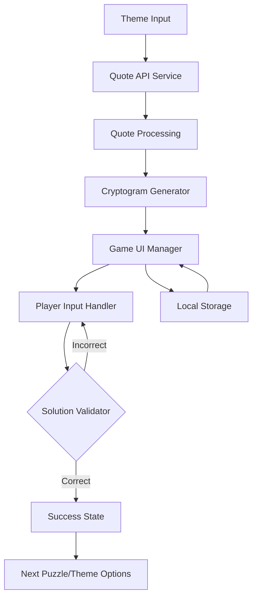

# Themed Cryptogram Game - Technical Specification

## System Architecture



## Core Components

### 1. Theme-Based Quote Service
```javascript
class QuoteService {
  constructor() {
    this.API_ENDPOINTS = {
      primary: 'https://api.quotable.io/random',
      fallback: 'https://api.api-ninjas.com/v1/quotes'
    };
    this.themeCache = new Map(); // Cache for previously fetched themes
  }

  async getQuoteByTheme(theme) {
    // Implementation with fallback and caching
  }
}
```

### 2. Cryptogram Generator
```javascript
class CryptogramGenerator {
  constructor() {
    this.substitutionMap = new Map();
    this.solutionMap = new Map();
  }

  generatePuzzle(quote) {
    // Create one-to-one letter mapping
    // Preserve spaces, punctuation
    // Return encoded text and maps
  }
}
```

### 3. Game UI Components
Based on the provided screenshot, implementing a clean, minimalist design:

```javascript
class GameUI {
  constructor(container) {
    this.elements = {
      themeInput: null,
      puzzleGrid: null,
      letterBank: null,
      swapsCounter: null,
      clueDisplay: null
    };
    this.initialize(container);
  }

  createLetterTile(letter, index) {
    // Create draggable letter tiles
    // Style matching screenshot aesthetic
  }
}
```

## UI Design Specifications

### Layout Components
1. Theme Header
   - Large text display of current theme
   - Clean, sans-serif font
   - Centered alignment

2. Progress Counter
   - "X Swaps Left" display
   - Large number style
   - Centered below theme

3. Letter Grid
   - Draggable letter tiles
   - Blue border for active tiles
   - Black/white color scheme
   - Clear letter spacing
   - Numbered hints (like crossword references)

4. Clue Section
   - Navy blue background
   - White text
   - Left/right navigation arrows
   - Centered clue text

### Visual Style
```css
:root {
  --primary-blue: #3498db;
  --dark-navy: #2c3e50;
  --text-dark: #2c3e50;
  --text-light: #ffffff;
  --tile-border: #3498db;
  --background: #f5f6fa;
}
```

## Game Logic Implementation

### 1. Letter Swapping System
```javascript
class LetterSwapHandler {
  constructor() {
    this.maxSwaps = 40; // Configurable
    this.currentSwaps = 0;
  }

  handleSwap(letter1, letter2) {
    // Implement drag-and-drop or click-to-swap
    // Update swap counter
    // Validate move
  }
}
```

### 2. Progress Tracking
```javascript
class ProgressManager {
  constructor() {
    this.storage = window.localStorage;
    this.currentStreak = 0;
  }

  saveProgress() {
    // Save current game state
    // Track theme history
    // Store statistics
  }
}
```

## Data Flow

1. Theme Input → API Request
   - Sanitize input
   - Check cache
   - Make API request
   - Handle fallbacks

2. Quote → Cryptogram
   - Generate substitution map
   - Create puzzle grid
   - Set up letter bank

3. User Interaction
   - Handle letter swaps
   - Update UI
   - Track progress
   - Validate solution

## Implementation Phases

### Phase 1: Core Functionality
- Basic UI layout
- Quote API integration
- Simple cryptogram generation
- Letter swapping mechanics

### Phase 2: Enhanced Features
- Theme caching
- Progress tracking
- Improved animations
- Mobile responsiveness

### Phase 3: Polish
- Achievement system
- Theme suggestions
- Difficulty levels
- Hint system

## Technical Requirements

- Modern JavaScript (ES6+)
- CSS Grid/Flexbox for layout
- Local Storage for game state
- Touch events for mobile support
- Error handling for API failures
- Responsive design (mobile-first)

## Testing Strategy

1. Unit Tests
   - Quote fetching
   - Cryptogram generation
   - Solution validation

2. Integration Tests
   - API fallback behavior
   - State management
   - Progress tracking

3. UI Testing
   - Responsive design
   - Touch interactions
   - Keyboard accessibility

## Performance Considerations

1. API Optimization
   - Implement caching
   - Rate limit handling
   - Batch requests where possible

2. UI Performance
   - Debounce user input
   - Optimize animations
   - Lazy load components

3. Storage
   - Implement quota management
   - Clean up old data
   - Compress stored data

## Security Measures

1. Input Sanitization
   - Theme input validation
   - API response validation
   - XSS prevention

2. API Security
   - Rate limiting
   - API key protection
   - CORS handling

3. Data Protection
   - Secure storage practices
   - Session management
   - Error message sanitization
